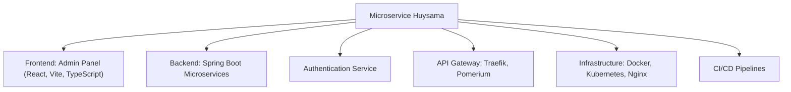

# 🚀 Microservice Huysama – Hệ Thống Quản Lý Nền Tảng Microservices

[](https://openjdk.org/)
[](https://spring.io/projects/spring-boot)
[](https://react.dev/)
[](https://vitejs.dev/)
[](https://www.docker.com/)
[](https://kubernetes.io/)
[](https://traefik.io/)
[](https://www.pomerium.com/)
[](LICENSE)

---

## 📋 Tổng Quan Dự Án

**Microservice Huysama** là hệ thống quản lý nền tảng microservices hiện đại, tối ưu cho khả năng mở rộng, bảo mật và DevOps. Dự án tích hợp frontend React, backend Spring Boot, authentication service, API Gateway (Traefik, Pomerium), CI/CD, containerization và orchestration với Kubernetes.

### 🎯 Mục Tiêu Chính
- Quản lý hệ thống phân tán, module hóa, dễ mở rộng
- Đảm bảo bảo mật, xác thực tập trung, SSO
- Tối ưu DevOps: CI/CD, container hóa, tự động hóa triển khai
- Giao diện quản trị hiện đại, thân thiện

---

## ✨ Tính Năng Chính
- **Quản trị hệ thống** qua admin panel hiện đại
- **Xác thực & phân quyền** tập trung, bảo mật (Zero Trust, SSO)
- **API Gateway** với Traefik & Pomerium
- **Triển khai đa môi trường**: Docker, Kubernetes, Minikube
- **CI/CD pipelines** tự động hóa build, test, deploy
- **Monitoring & Healthcheck** với Actuator, metrics

---

## 🏗️ Kiến Trúc Hệ Thống


*Sơ đồ kiến trúc hệ thống do Huysama tự thiết kế, chi tiết và tối ưu.*



---

## 📁 Cấu Trúc Thư Mục

```
microservice-huysama/
├── microservice-huysama-admin-panel/   # Frontend (React, Vite, TypeScript)
├── springbootmca/                      # Backend (Spring Boot, Java)
├── microservice-huysama-authentication-service/ # Auth Service
├── microservice-huysama-pomerium/      # Pomerium SSO & Routing
├── microservice-huysama-traefik/       # Traefik Ingress
├── cicd/                               # CI/CD pipelines
├── minikube/                           # Kubernetes manifests
├── docker-compose.yml                  # Orchestration
└── ...
```

---

## 🔧 Công Nghệ Sử Dụng

| Thành Phần         | Công Nghệ         | Phiên Bản      |
|--------------------|-------------------|---------------|
| **Frontend**       | React, Vite, TS   | 18.x, 4.x      |
| **Backend**        | Spring Boot, Java | 3.x, 17+       |
| **Auth**           | Spring Security   | 6.x            |
| **API Gateway**    | Traefik, Pomerium | 2.x, 0.24.x    |
| **Container**      | Docker            | 24.0+          |
| **Orchestration**  | Kubernetes        | 1.29+          |
| **CI/CD**          | Custom Pipelines  | cicd/          |
| **Monitoring**     | Spring Actuator   | 3.x            |

---

## ⚡ Khởi Động Nhanh

### Yêu cầu môi trường
- Docker & Docker Compose
- Minikube (Kubernetes local)
- Java (JDK 17+)
- Node.js & pnpm

### Cài đặt

1. **Clone repository:**
   ```bash
   git clone <repository-url>
   cd microservice-huysama
   ```
2. **Cài đặt Backend (Spring Boot):**
   ```bash
   cd springbootmca
   mvn clean install
   cd ..
   ```
3. **Cài đặt Frontend (Admin Panel):**
   ```bash
   cd microservice-huysama-admin-panel
   pnpm install
   cd ..
   ```
4. **Khởi động toàn bộ dịch vụ (Docker Compose):**
   ```bash
   docker-compose up -d
   ```

---

## 🌐 Sử Dụng

- **Trang Quản Trị:** [http://localhost:<admin-port>](http://localhost:<admin-port>)
- **API Gateway:** [http://localhost:<traefik-port>](http://localhost:<traefik-port>)

> Tham khảo `docker-compose.yml` và cấu hình dịch vụ để biết chi tiết cổng.

---

## 📚 API & Documentation
- **RESTful API** cho quản trị, xác thực, phân quyền
- **Swagger UI**: Tích hợp cho backend (Spring Boot)
- **Healthcheck**: `/actuator/health`, `/actuator/metrics`

---

## 🔒 Bảo Mật
- **Zero Trust, SSO** với Pomerium, Spring Security
- **Role-based Access Control (RBAC)**
- **JWT/OAuth2** cho xác thực
- **Session management**
- **CSRF, SQL injection prevention**

---

## 📈 Monitoring & Health Checks
- **Spring Actuator**: Health, metrics, info, loggers
- **Prometheus/Grafana** (có thể tích hợp)

---

## 🧪 Testing
- **Unit Test**: JUnit, Jest
- **Integration Test**: Spring Test, API test

---

## 🚀 Triển Khai & DevOps
- **Dockerfile** cho từng service
- **docker-compose.yml** orchestration
- **Kubernetes manifests** (Minikube)
- **CI/CD pipelines** (thư mục `cicd/`)

---

## 🤝 Đóng Góp
1. Fork repository
2. Tạo branch mới (`feature/your-feature`)
3. Commit & push
4. Mở Pull Request

---

## 📞 Hỗ Trợ
- **Email**: huy.trannguyenhoang7
- **GitHub Issues**: [Tạo Issue](#)

---

## 📄 License

Dự án này sử dụng giấy phép **MIT License**.

---

## 🙏 Acknowledgments
- **Spring Boot Team**
- **React Community**
- **Traefik & Pomerium**
- **Docker & Kubernetes**

---

**⭐ Nếu dự án hữu ích, hãy cho mình một star!**

---

## 🌐 Sử Dụng

- **Trang Quản Trị:** [http://localhost:<admin-port>](http://localhost:<admin-port>)
- **API Gateway:** [http://localhost:<traefik-port>](http://localhost:<traefik-port>)

> Tham khảo `docker-compose.yml` và cấu hình dịch vụ để biết chi tiết cổng.

---

## 📦 Cấu Trúc Dự Án

- `microservice-huysama-admin-panel/` – Frontend admin panel (React, Vite, TypeScript)
- `springbootmca/` – Backend microservices (Spring Boot, Java)
- `microservice-huysama-authentication-service/` – Dịch vụ xác thực độc lập
- `microservice-huysama-pomerium/` – Pomerium SSO & định tuyến bảo mật
- `microservice-huysama-traefik/` – Traefik ingress controller
- `cicd/` – Cấu hình CI/CD pipeline
- `minikube/` – Manifest Kubernetes cho phát triển local
- `docker-compose.yml` – Orchestration đa dịch vụ

---

## 💡 Điểm Nổi Bật

- **Mở rộng & Dễ bảo trì:** Kiến trúc module hóa, dễ mở rộng
- **Bảo mật tối đa:** Zero Trust, SSO, xác thực tập trung
- **Sẵn sàng DevOps:** CI/CD, container hóa, hỗ trợ Kubernetes
- **UI/UX hiện đại:** Admin panel responsive, thân thiện
- **Chuẩn sản xuất:** Mô hình triển khai thực tế

---

## 👤 Tác giả & Đóng góp

Phát triển bởi Huysama – Kỹ sư Full-stack & DevOps

---

## 📄 Giấy phép

Dự án sử dụng giấy phép MIT.

---

*English version available at [`README.md`](./README.md)*