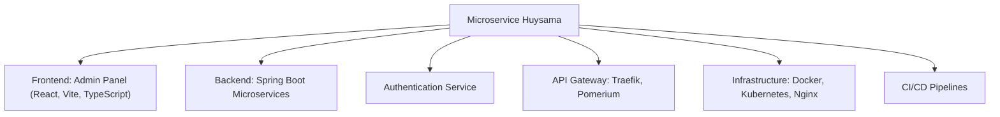

# 🚀 Microservice Huysama – Modern Microservices Platform

[](https://openjdk.org/)
[](https://spring.io/projects/spring-boot)
[](https://react.dev/)
[](https://vitejs.dev/)
[](https://www.docker.com/)
[](https://kubernetes.io/)
[](https://traefik.io/)
[](https://www.pomerium.com/)
[](LICENSE)

---

## 📋 Project Overview

**Microservice Huysama** is a modern, scalable, and secure microservices platform. It integrates a React frontend, Spring Boot backend, authentication service, API Gateway (Traefik, Pomerium), CI/CD, containerization, and Kubernetes orchestration.

### 🎯 Main Objectives
- Manage distributed, modular, and extensible systems
- Ensure security, centralized authentication, and SSO
- Optimize DevOps: CI/CD, containerization, automated deployment
- Provide a modern, user-friendly admin interface

---

## ✨ Key Features
- **System management** via a modern admin panel
- **Centralized authentication & authorization** (Zero Trust, SSO)
- **API Gateway** with Traefik & Pomerium
- **Multi-environment deployment**: Docker, Kubernetes, Minikube
- **CI/CD pipelines** for automated build, test, deploy
- **Monitoring & Healthcheck** with Actuator, metrics

---

## 🏗️ System Architecture


*Custom system architecture diagram, meticulously designed by Huysama.*



---

## 📁 Project Structure

```
microservice-huysama/
├── microservice-huysama-admin-panel/   # Frontend (React, Vite, TypeScript)
├── springbootmca/                      # Backend (Spring Boot, Java)
├── microservice-huysama-authentication-service/ # Auth Service
├── microservice-huysama-pomerium/      # Pomerium SSO & Routing
├── microservice-huysama-traefik/       # Traefik Ingress
├── cicd/                               # CI/CD pipelines
├── minikube/                           # Kubernetes manifests
├── docker-compose.yml                  # Orchestration
└── ...
```

---

## 🔧 Technologies Used

| Component           | Technology         | Version      |
|---------------------|-------------------|--------------|
| **Frontend**        | React, Vite, TS   | 18.x, 4.x    |
| **Backend**         | Spring Boot, Java | 3.x, 17+     |
| **Auth**            | Spring Security   | 6.x          |
| **API Gateway**     | Traefik, Pomerium | 2.x, 0.24.x  |
| **Container**       | Docker            | 24.0+        |
| **Orchestration**   | Kubernetes        | 1.29+        |
| **CI/CD**           | Custom Pipelines  | cicd/        |
| **Monitoring**      | Spring Actuator   | 3.x          |

---

## ⚡ Quick Start

### Prerequisites
- Docker & Docker Compose
- Minikube (local Kubernetes)
- Java (JDK 17+)
- Node.js & pnpm

### Installation

1. **Clone the repository:**
   ```bash
   git clone https://github.com/HoangHuy7/huysama-microservice.git
   cd microservice-huysama
   ```
2. **Backend Setup (Spring Boot):**
   ```bash
   cd springbootmca
   mvn clean install
   cd ..
   ```
3. **Frontend Setup (Admin Panel):**
   ```bash
   cd microservice-huysama-admin-panel
   pnpm install
   cd ..
   ```
4. **Start all services (Docker Compose):**
   ```bash
   docker-compose up -d
   ```

---

## 🌐 Usage

- **Admin Panel:** [http://localhost:<admin-port>](http://localhost:<admin-port>)
- **API Gateway:** [http://localhost:<traefik-port>](http://localhost:<traefik-port>)

> See `docker-compose.yml` and service configs for port details.

---

## 📚 API & Documentation
- **RESTful API** for management, authentication, authorization
- **Swagger UI**: Integrated for backend (Spring Boot)
- **Healthcheck**: `/actuator/health`, `/actuator/metrics`

---

## 🔒 Security
- **Zero Trust, SSO** with Pomerium, Spring Security
- **Role-based Access Control (RBAC)**
- **JWT/OAuth2** authentication
- **Session management**
- **CSRF, SQL injection prevention**

---

## 📈 Monitoring & Health Checks
- **Spring Actuator**: Health, metrics, info, loggers
- **Prometheus/Grafana** (optional integration)

---

## 🧪 Testing
- **Unit Test**: JUnit, Jest
- **Integration Test**: Spring Test, API test

---

## 🚀 Deployment & DevOps
- **Dockerfile** for each service
- **docker-compose.yml** orchestration
- **Kubernetes manifests** (Minikube)
- **CI/CD pipelines** (`cicd/` directory)

---

## 🤝 Contribution
1. Fork the repository
2. Create a new branch (`feature/your-feature`)
3. Commit & push
4. Open a Pull Request

---

## 📞 Support
- **Email**: huy.trannguyenhoang7@gmail.com
- **GitHub Issues**: [Create Issue](#)

---

## 📄 License

This project is licensed under the **MIT License**.

---

## 🙏 Acknowledgments
- **Spring Boot Team**
- **React Community**
- **Traefik & Pomerium**
- **Docker & Kubernetes**

---

**⭐ If you find this project useful, please give it a star!**
