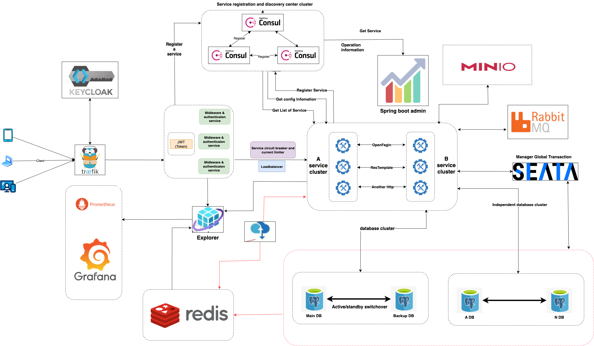

# Microservice Huysama Project (English)

A comprehensive microservices project designed for scalability and maintainability. This project includes a frontend admin panel, an authentication service, and various infrastructure components for deployment and management.

## Architecture

The system is designed with a microservices architecture. Below is a diagram illustrating the overall structure:



## Features

*   **Admin Panel:** A modern, responsive user interface for managing the system.
*   **Authentication Service:** Secure user authentication and authorization.
*   **Service Discovery & Routing:** Managed by Traefik and Pomerium for secure ingress and service-to-service communication.
*   **Containerization:** All services are containerized using Docker for consistent environments.
*   **Orchestration:** Kubernetes (Minikube) configurations for local development and testing.

## Technologies Used

*   **Frontend:** React, Vite, TypeScript
*   **Backend:** Spring Boot, Java
*   **Infrastructure:** Docker, Docker Compose, Kubernetes (Minikube), Nginx
*   **Networking:** Traefik, Pomerium
*   **CI/CD:** Pipelines configured in the `cicd` directory.

## Getting Started

### Prerequisites

*   Docker & Docker Compose
*   Minikube (for local Kubernetes deployment)
*   Java (JDK)
*   Node.js & pnpm

### Installation

1.  **Clone the repository:**
    ```bash
    git clone <repository-url>
    cd microservice-huysama
    ```

2.  **Backend Setup (Spring Boot):**
    Navigate to the `springbootmca` directory and build the services:
    ```bash
    cd springbootmca
    mvn clean install
    cd ..
    ```

3.  **Frontend Setup (Admin Panel):**
    Navigate to the `microservice-huysama-admin-panel` directory and install dependencies:
    ```bash
    cd microservice-huysama-admin-panel
    pnpm install
    cd ..
    ```

4.  **Start all services using Docker Compose:**
    ```bash
    docker-compose up -d
    ```

## Usage

After installation, the services will be available at their configured ports.
*   **Admin Panel:** `http://localhost:<admin-port>`
*   **API Gateway:** `http://localhost:<traefik-port>`

Refer to the `docker-compose.yml` and individual service configurations for specific port details.

---

# Dự án Microservice Huysama (Tiếng Việt)

Một dự án microservices toàn diện được thiết kế để có khả năng mở rộng và bảo trì. Dự án này bao gồm một trang quản trị (admin panel) frontend, một dịch vụ xác thực (authentication service), và nhiều thành phần hạ tầng khác nhau để triển khai và quản lý.

## Kiến trúc hệ thống

Hệ thống được thiết kế theo kiến trúc microservices. Dưới đây là sơ đồ minh họa cấu trúc tổng thể:


## Tính năng

*   **Trang Quản Trị:** Giao diện người dùng hiện đại, đáp ứng (responsive) để quản lý hệ thống.
*   **Dịch vụ Xác thực:** Xác thực và ủy quyền người dùng an toàn.
*   **Định tuyến & Khám phá Dịch vụ:** Được quản lý bởi Traefik và Pomerium để đảm bảo ingress an toàn và giao tiếp giữa các dịch vụ.
*   **Containerization:** Tất cả các dịch vụ được đóng gói bằng Docker để đảm bảo môi trường nhất quán.
*   **Orchestration:** Cấu hình Kubernetes (Minikube) cho việc phát triển và kiểm thử cục bộ.

## Công nghệ sử dụng

*   **Frontend:** React, Vite, TypeScript
*   **Backend:** Spring Boot, Java
*   **Hạ tầng:** Docker, Docker Compose, Kubernetes (Minikube), Nginx
*   **Mạng:** Traefik, Pomerium
*   **CI/CD:** Các pipeline được cấu hình trong thư mục `cicd`.

## Bắt đầu

### Yêu cầu cài đặt

*   Docker & Docker Compose
*   Minikube (để triển khai Kubernetes cục bộ)
*   Java (JDK)
*   Node.js & pnpm

### Cài đặt

1.  **Clone repository:**
    ```bash
    git clone <repository-url>
    cd microservice-huysama
    ```

2.  **Cài đặt Backend (Spring Boot):**
    Đi đến thư mục `springbootmca` và build các dịch vụ:
    ```bash
    cd springbootmca
    mvn clean install
    cd ..
    ```

3.  **Cài đặt Frontend (Admin Panel):**
    Đi đến thư mục `microservice-huysama-admin-panel` và cài đặt các dependencies:
    ```bash
    cd microservice-huysama-admin-panel
    pnpm install
    cd ..
    ```

4.  **Khởi chạy tất cả dịch vụ bằng Docker Compose:**
    ```bash
    docker-compose up -d
    ```

## Sử dụng

Sau khi cài đặt, các dịch vụ sẽ có sẵn tại các cổng đã được cấu hình.
*   **Trang Quản Trị:** `http://localhost:<admin-port>`
*   **API Gateway:** `http://localhost:<traefik-port>`

Tham khảo file `docker-compose.yml` và cấu hình của từng dịch vụ để biết chi tiết về các cổng.
