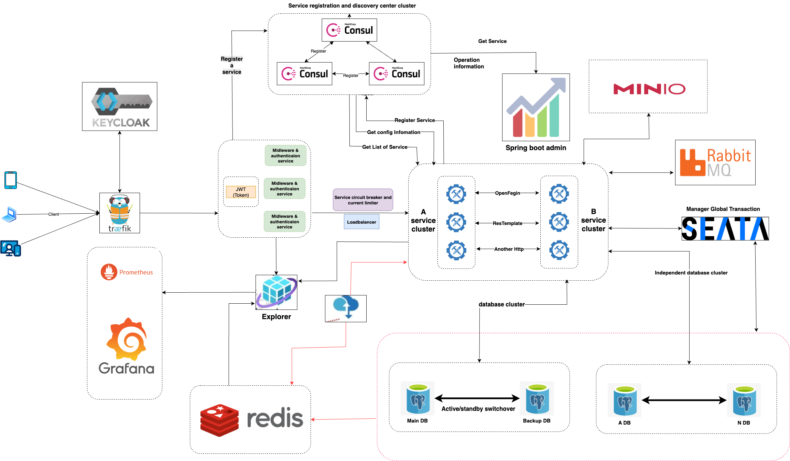

# Minikube Microservice Configuration

This project provides a collection of Kubernetes manifests and a templating system to deploy a microservices application on a local Minikube cluster. It includes configurations for services, ingress controllers (Nginx and Traefik), and a Python script to dynamically render ConfigMaps from Jinja2 templates.

## System Architecture



## Prerequisites

Before you begin, ensure you have the following installed:
- [Minikube](https://minikube.sigs.k8s.io/docs/start/)
- [kubectl](https://kubernetes.io/docs/tasks/tools/install-kubectl/)
- [Python 3](https://www.python.org/downloads/)
- [Jinja2](https://pypi.org/project/Jinja2/) (`pip install jinja2`)

## How to Use

1.  **Start Minikube:**
    ```bash
    minikube start
    ```

2.  **Create the Namespace:**
    Apply the base namespace configuration.
    ```bash
    kubectl apply -f base/namespace.yaml
    ```

3.  **Render the ConfigMap:**
    Run the Python script to generate the `render-configmap.yaml` from the Jinja2 template. This script reads data from `base/configmap.yaml` and injects it into `base/configmap.yaml.j2`.
    ```bash
    python render_configmap.py
    ```

4.  **Apply the ConfigMap:**
    ```bash
    kubectl apply -f render-configmap.yaml
    ```

5.  **Deploy Services:**
    Deploy the application services, like the Nginx deployment included in this project.
    ```bash
    kubectl apply -f services/
    ```

6.  **Deploy an Ingress Controller:**
    Choose one of the available ingress controllers.

    *   **For Nginx Ingress:**
        ```bash
        kubectl apply -f ingress/nginx-ingress.yaml
        ```

    *   **For Traefik Ingress:**
        ```bash
        # Apply Traefik's Custom Resource Definitions (CRDs) and core configuration
        kubectl apply -f traefik/
        
        # Apply the ingress route for your service
        kubectl apply -f ingress/traefik-ingress.yaml
        ```

## Project Structure

```
├── render_configmap.py     # Script to render ConfigMap from template
├── render-configmap.yaml   # The output of the render script
├── base/                   # Base Kubernetes objects
│   ├── configmap.yaml      # Data/values for the template
│   ├── configmap.yaml.j2   # Jinja2 template for the ConfigMap
│   └── namespace.yaml      # Namespace definition
├── ingress/                # Ingress configurations
│   ├── nginx-ingress.yaml  # Ingress rules for Nginx
│   └── traefik-ingress.yaml# IngressRoute for Traefik
├── services/               # Kubernetes Service and Deployment manifests
│   └── nginx-deployment.yaml
└── traefik/                # Traefik-specific configurations and CRDs
    └── traefik.yml
```

---

# Cấu hình Microservice trên Minikube

Dự án này cung cấp một bộ sưu tập các tệp manifest Kubernetes và một hệ thống templating để triển khai ứng dụng microservice trên một cụm Minikube cục bộ. Nó bao gồm các cấu hình cho service, ingress controller (Nginx và Traefik), và một script Python để tạo (render) ConfigMap một cách tự động từ template Jinja2.

## Kiến trúc hệ thống


## Yêu cầu cài đặt

Trước khi bắt đầu, hãy đảm bảo bạn đã cài đặt các công cụ sau:
- [Minikube](https://minikube.sigs.k8s.io/docs/start/)
- [kubectl](https://kubernetes.io/docs/tasks/tools/install-kubectl/)
- [Python 3](https://www.python.org/downloads/)
- [Jinja2](https://pypi.org/project/Jinja2/) (`pip install jinja2`)

## Hướng dẫn sử dụng

1.  **Khởi động Minikube:**
    ```bash
    minikube start
    ```

2.  **Tạo Namespace:**
    Áp dụng cấu hình namespace cơ sở.
    ```bash
    kubectl apply -f base/namespace.yaml
    ```

3.  **Tạo ConfigMap:**
    Chạy script Python để tạo tệp `render-configmap.yaml` từ template Jinja2. Script này sẽ đọc dữ liệu từ `base/configmap.yaml` và đưa vào template `base/configmap.yaml.j2`.
    ```bash
    python render_configmap.py
    ```

4.  **Áp dụng ConfigMap:**
    ```bash
    kubectl apply -f render-configmap.yaml
    ```

5.  **Triển khai Services:**
    Triển khai các service của ứng dụng, ví dụ như deployment Nginx có trong dự án này.
    ```bash
    kubectl apply -f services/
    ```

6.  **Triển khai Ingress Controller:**
    Chọn một trong các ingress controller có sẵn.

    *   **Đối với Nginx Ingress:**
        ```bash
        kubectl apply -f ingress/nginx-ingress.yaml
        ```

    *   **Đối với Traefik Ingress:**
        ```bash
        # Áp dụng các Custom Resource Definitions (CRDs) và cấu hình lõi của Traefik
        kubectl apply -f traefik/
        
        # Áp dụng IngressRoute cho service của bạn
        kubectl apply -f ingress/traefik-ingress.yaml
        ```

## Cấu trúc dự án

```
├── render_configmap.py     # Script để tạo ConfigMap từ template
├── render-configmap.yaml   # Tệp kết quả sau khi chạy script render
├── base/                   # Các đối tượng Kubernetes cơ sở
│   ├── configmap.yaml      # Dữ liệu/giá trị cho template
│   ├── configmap.yaml.j2   # Template Jinja2 cho ConfigMap
│   └── namespace.yaml      # Định nghĩa Namespace
├── ingress/                # Cấu hình Ingress
│   ├── nginx-ingress.yaml  # Quy tắc Ingress cho Nginx
│   └── traefik-ingress.yaml# Cấu hình IngressRoute cho Traefik
├── services/               # Manifest cho Kubernetes Service và Deployment
│   └── nginx-deployment.yaml
└── traefik/                # Các cấu hình và CRD riêng của Traefik
    └── traefik.yml
```